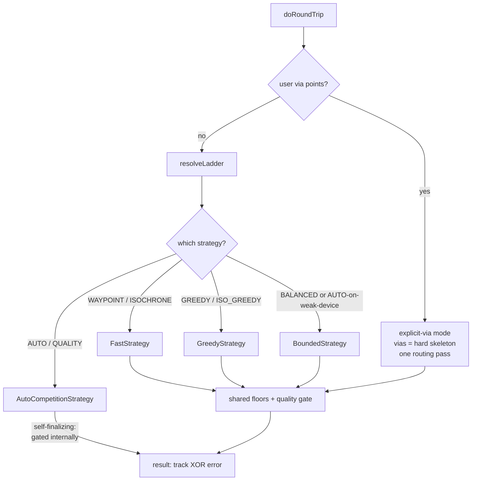
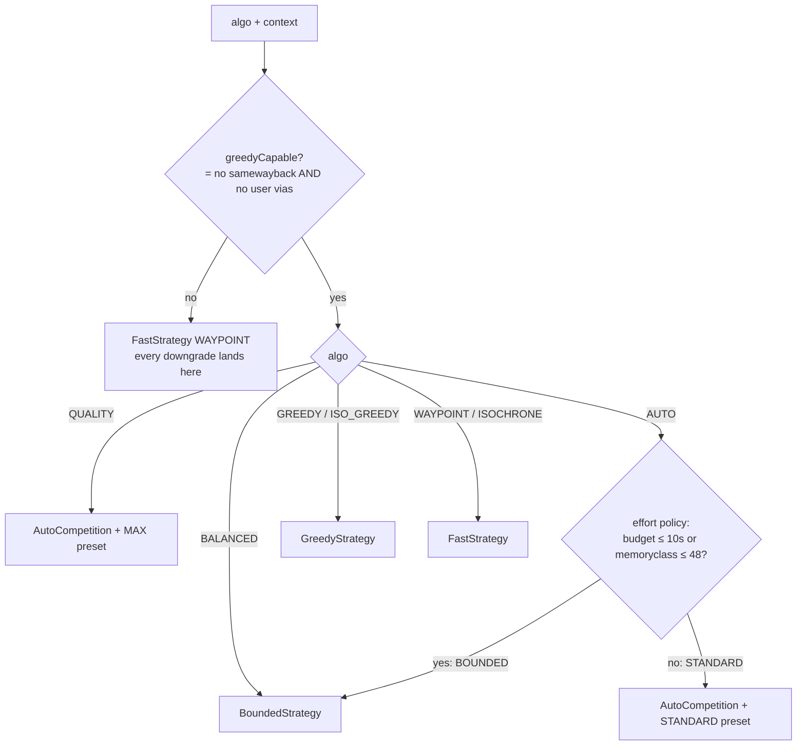
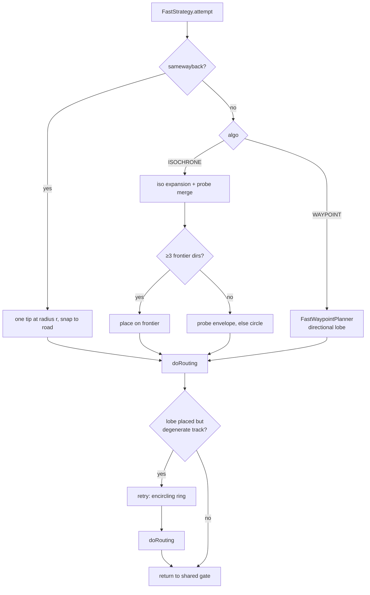
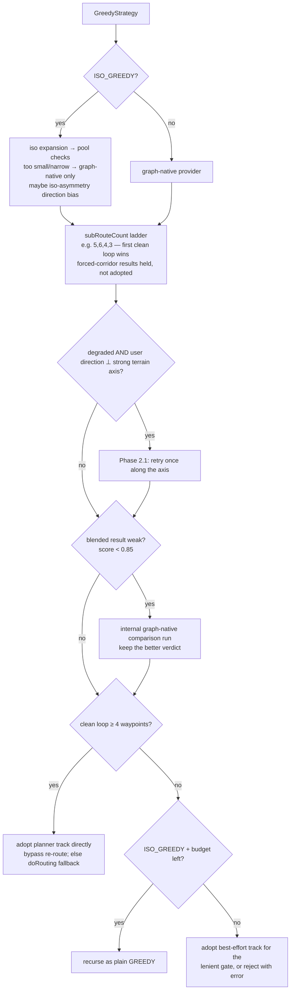
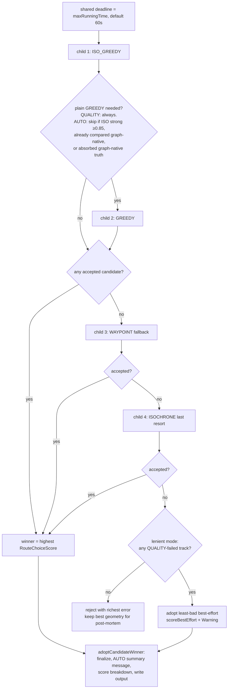

# Round-Trip Strategies — Reviewer's Guide

Scope: `brouter-core/src/main/java/btools/router/roundtrip/`
Audience: developers working on or reviewing the round-trip subsystem.

## 1. Big picture

A round-trip request ("give me a 60 km loop from here") enters at
`RoundTripOrchestrator.doRoundTrip()`. The orchestrator:

1. Converts the requested loop length `L` into a **search radius** `r = L / 2π`
   (a loop traces roughly the circle circumference).
2. Picks a **direction** (user-supplied, or a random one derived from map data).
3. Branches into **explicit-via mode** (user supplied via points → they are a hard
   route skeleton, no generated points) or **generated-loop mode**.
4. In generated-loop mode it resolves a **tier ladder** (`resolveLadder`) that maps
   the requested algorithm to exactly one strategy object, and runs it.
5. Every outcome then passes shared **floors** (enough waypoints, ≥ 6 nodes,
   ≥ 200 m) and the uniform **quality gate** — except the AUTO/QUALITY competition,
   which gates its candidates internally and is *self-finalizing*.
6. The `finally` block enforces the result contract: **track XOR error** — a
   request ends with a usable track or a clean error message, never both.

## 2. The algorithm enum vs. the strategy classes

`RoundTripAlgorithm` has 7 values; only 4 are user-facing tiers:

| User tier | Enum value | Strategy class | Idea |
|---|---|---|---|
| FAST | `WAYPOINT` (alias `FAST`) | `FastStrategy` | Place vias geometrically, route once. Sub-second, lowest quality. |
| BALANCED | `BALANCED` | `BoundedStrategy` | One budgeted ISO_GREEDY run (~8 s), FAST fallback. Predictable latency (interactive/mobile default). |
| AUTO (default) | `AUTO` | `AutoCompetitionStrategy` | Competition of ISO_GREEDY + GREEDY (+ fallbacks) in child engines; keeps the best. Effort resolved from context. |
| QUALITY | `QUALITY` | `AutoCompetitionStrategy` pinned to the MAX preset | Same competition, max effort. Configuration, not a separate implementation. |

The remaining values are internal competitors / building blocks, but can be forced
explicitly (tests do):

- `GREEDY` — iterative routed-leg planner with **graph-native** candidates.
- `ISO_GREEDY` — same planner with a **blended isochrone + graph-native** candidate pool.
- `ISOCHRONE` — direct waypoint placement from the isochrone frontier (no routed
  legs during placement); reached via `roundTripIsochrone=1` or as AUTO's last resort.

`RoundTripStrategy` is the seam: `attempt(request, slice)` runs one tier, leaves the
outcome on the request, and returns `true` when the orchestrator's shared gate must
still run (`false` = self-finalizing, only the AUTO competition).

### Ladder resolution (`resolveLadder`)

`RoundTripEffortPolicy` presets (worth knowing when reviewing budgets):

| Preset | topK normal/late | plan budget scale | tier budget | retry layers | greedy always |
|---|---|---|---|---|---|
| BOUNDED (BALANCED) | 2 / 3 | 1.0 | 8 000 ms per slice | skipped | no |
| STANDARD (AUTO) | 3 / 5 | 1.0 | none | on | no |
| MAX (QUALITY) | 4 / 6 | 2.0 | none | on | **yes** |

## 3. FastStrategy (WAYPOINT / ISOCHRONE)

Geometric placement, then **one** engine routing pass. No planner, no routed
candidate legs — that is why it is ~10× faster and lower quality.

Placement paths (recorded in `PlacementPath` counters):

- **WAYPOINT, optimized (default)**: `FastWaypointPlanner` places a *directional
  lobe* — the loop heads toward the requested bearing — reusing probe-snapped road
  nodes as vias (no separate validation pass). If the lobe *places* but routing
  produces a degenerate stub, one retry with an *encircling ring* around the start.
- **WAYPOINT, legacy** (`-Droundtrip.fast.optimized=false`): reachability probe →
  place vias on the probe envelope → validate/re-match → route.
- **ISOCHRONE**: run an isochrone expansion from the start, merge the frontier with
  the probe directions, place vias on the merged frontier. Fallbacks: probe
  envelope → plain circle.
- **allowSamewayback**: place a single tip at radius `r` in the requested direction;
  the engine mirrors the out-leg back.

A *variety seed* (`alternativeidx`) perturbs direction (±15°), radius (±3 %) and via
count (±1) deterministically; seed 0 is bit-identical to the unseeded baseline.

## 4. GreedyStrategy (GREEDY / ISO_GREEDY)

The quality workhorse. It wraps `GreedyRoundTripPlanner` (based on CEUR-WS
Vol-3885), which builds the loop **one routed leg at a time**.

### 4.1 The planner core (per plan)

The loop is split into `subRouteCount` legs (3–6, from loop length; +1 for MTB).
Per step:

1. A `RoundTripCandidateProvider` generates via candidates near the target
   sub-distance. GREEDY: graph-native candidates (real road nodes found per step).
   ISO_GREEDY: those blended with a start-centered isochrone pool.
2. **All** candidates get a cheap O(1) air-distance score (`CandidateScorer` plus
   shape terms: heading persistence, angular-sweep convexity, unimodal radius —
   all fade in constrained terrain).
3. A small **top-K with angular spread** is routed with full Dijkstra and re-scored
   on routed distance, edge reuse (`VisitedEdgeStore`), and cost.
4. Best candidate commits; on failure the radius shrinks and it retries.
5. One return-path check verifies the loop can close within tolerance (5 %).

Routing only the top-K per step (2–6 legs, see the presets) instead of every
candidate is what keeps this real-time.

ISO_GREEDY extras: `IsoPoolHealth` tracks whether the iso pool is trustworthy —
a DEGRADED pool loses its prior scoring terms and cedes a routed slot to
graph-native candidates; UNHEALTHY switches the plan to graph-native-only steps.
`ReturnDistanceOracle` gives sector-resolved return estimates from the expansion
(plain GREEDY deliberately has none — measured quality-negative).

### 4.2 The strategy around the planner

Review-relevant details:

- **subRouteCount ladder**: each rung is a full `plan()`; rungs stop when the
  remaining request budget drops below `MIN_LADDER_RUNG_BUDGET_MS` (3 s). The
  *first* rung is exempt (minimum-slice floors fund exactly one run).
- **Forced corridor** (`forcedCorridorAccepted`): a rung that could only close by
  reusing a corridor same-way-back is *held*, not adopted — a later rung may find a
  clean loop. Shipped only if no rung is clean; the gate then treats it as a
  disclosed OUT_AND_BACK.
- **Track adoption bypass**: the planner re-tracks each committed leg, so its merged
  track has full per-edge data and is adopted **directly**. The old re-route through
  `doRouting` (fragile corridor mechanism, ~80 % fail/diverge in bad cases) is only
  the fallback.
- Both the internal-comparison trigger and its selection score through the *same*
  function (`scoreInternalGreedyResult`) — they drifted once and cost a spurious
  extra ladder for ferry loops.

## 5. BoundedStrategy (BALANCED, and AUTO on constrained resources)

Contract: predictable latency, always returns *some* loop if one exists.

1. One ISO_GREEDY dispatch under a hard slice: deadline = `min(request budget,
   8 s)`, reduced top-K (2/3), `skipRetryLayers` (no Phase 2.1 retry, no
   ISO_GREEDY→GREEDY recursion). Engine timers are floored to the slice too.
2. If the planner track would be **hard-rejected** by the gate, it is dropped *now*
   (pre-gate) so the fallback still has a chance; a surviving track's verdict is
   stashed in `request.boundedGateVerdict` so the shared gate doesn't pay a second
   full evaluation.
3. If no track: fall back to one FAST/WAYPOINT attempt under a **fresh** tier slice
   (worst case two slices). With `allowSamewayback` only this fallback runs, still
   under the tier budget.
4. The outcome always continues to the shared floors + gate (never self-finalizes).

## 6. AutoCompetitionStrategy (AUTO / QUALITY)

Runs candidate algorithms in **isolated child `RoutingEngine`s** (request-fields-only
copy of the `RoutingContext`, output suppressed, `quite=true`), scores gated results
with `RouteChoiceScore`, adopts the winner. **Self-finalizing**: `attempt()` returns
`false`; the winner is NOT re-gated by the orchestrator.

Review-relevant details:

- **Budget sharing**: one wall-clock deadline across all children; each child gets
  the remaining slice, floored at `MIN_CHILD_BUDGET_MS` (5 s) — a deliberate,
  bounded overrun so a spawned candidate never gets a ~0 ms slice.
- **Sequential children**: the candidates run one after another on the request
  thread (ISO_GREEDY first, then GREEDY only when still needed), so an AUTO
  request occupies one core and stays within the pool's "≈ 1 CPU-bound thread
  per request" assumption.
- **Termination cascade**: `ops.addTerminationHook(child::terminate)` — a server
  pre-emption of the parent must kill the child, which checks its kill flag per
  heap pop.
- Children run their own full pipeline including their own quality gate; the parent
  **re-gates** each returned track against its own context and scores only accepted
  ones.

## 7. Shared floors and the quality gate

After a non-self-finalizing strategy returns (and for explicit-via):

1. **Floors**: ≥ 2 intermediate waypoints (a loop needs at least a triangle;
   samewayback and explicit-via are exempt), ≥ 6 nodes, ≥ 200 m.
2. **Quality gate** (`RoundTripQualityGate.evaluate`): checks beeline segments,
   loop closure, distance ratio (band [0.5, 1.8]), profile-hostile surfaces,
   mid-route backtracking, self-crossing chaos. Shape-aware: `STRICT_LOOP`,
   `LOLLIPOP`, `OUT_AND_BACK` are accepted with disclosures; only
   `INVALID_RETRACE` is rejected on shape.
3. **Lenient by default**: STRUCTURAL failures always hard-reject; QUALITY failures
   ship the route with a `Warning:` message unless `roundTripStrictQuality=1`.
   (Tests asserting rejection must set strict mode.)
4. **Advisories** appended to `track.message` / `messageList[0]`: crossing count,
   out-and-back sections, undetailed straight-line chords, > 1.5× overshoot.

## 8. Why air distance, and why several approaches exist

### The cost pyramid

The only exact answer to "how far is it by road, for this profile?" is a full
Dijkstra leg — milliseconds to seconds each. A single request can imply thousands
of such questions: up to 36 candidates per step (`GraphNativeCandidateProvider.CANDIDATE_CAP`)
× 3–6 steps × ladder rungs × retry layers × AUTO children. Routing them all is
impossible in an interactive budget. So the planner uses a three-level pyramid:

| Level | Cost | Used for |
|---|---|---|
| Air distance (`CheapRuler`, O(1)) | ~free | Rank ALL candidates per step (`CandidateScorer`) |
| One Dijkstra expansion (isochrone) | one bounded graph search | Graph-truth metadata for a whole candidate pool at once |
| Full Dijkstra leg (`LegRouter`) | expensive | Only the top-K (2–6) survivors; re-scored on routed truth |

Air distance is corrected, not trusted: road distance ≈ `ROAD_INDIRECTNESS` (1.3)
× air distance, adaptively re-learned per plan (EMA, clamped to [1.3, 2.5], can
only grow more conservative). The committed loop is always routed truth — air
distance only decides *which few candidates are worth routing*.

### Where air distance lies — and what fixes it

Air distance is a good proxy exactly when the road network is dense and uniform
(then every candidate is off by the same ~1.3 factor and the *ranking* stays
correct). It misleads in constrained terrain: the sea has air distance but no
roads; a mountain ridge makes road distance 2×+ the straight line; a valley makes
one sector reachable and the opposite one not. That failure mode is what the
isochrone machinery exists for — iso candidates carry graph truth
(`costFromStart`, bucket density, contour depth), the hostility penalty reads
cost-per-airmeter, and the `ReturnDistanceOracle` replaces the global indirectness
EMA with sector-resolved return estimates. Caution for reviewers: mixing
optimistic estimates and compiled graph truth in one ranking ("mixed currency")
has caused real bugs before — see the source-quota fix around
`enforceSourceQuota`.

### Choosing between the approaches

Two independent axes: **how much compute** (latency budget) and **how much graph
truth the placement uses** (geometry assumption → frontier → per-leg routing).

| Approach | Graph truth used at placement | Best when | Weak when |
|---|---|---|---|
| WAYPOINT (FAST) | almost none (probe checks only) | dense/flat networks; instant preview | constrained terrain — geometric points land in unreachable spots, loop distorts/overshoots |
| ISOCHRONE | one expansion (frontier), no routed legs | asymmetric reachability (coast, valley) at low cost | no per-leg quality control; AUTO's last resort |
| GREEDY | per-step local expansions + routed top-K | good general quality; open terrain | its view is per-step/local — can start in the wrong sector when global reachability matters |
| ISO_GREEDY | start-centered pool (global picture) + per-step + routed top-K | terrain-asymmetric regions; the best single bet (BALANCED runs exactly this) | pool can be unhealthy (narrow corridor) — health tracker demotes to graph-native; upfront expansion cost |

Neither planner dominates — plain GREEDY wins roughly a quarter of AUTO
competition cells. That is the whole justification for the AUTO competition
(run both, gate, score, keep the best) and for QUALITY not being an ISO_GREEDY
alias.

## 9. Invariants a reviewer should hold the code against

- **Track XOR error** — enforced in `doRoundTrip`'s `finally` for every path;
  rejected geometry is preserved on `lastRejectedTrack` for post-mortem.
- **No ungated success** — every track passes exactly one gate: the shared gate,
  or (AUTO) the per-candidate gate inside the competition. Watch for paths that
  could skip both (e.g. exceptions during finalize are caught and turned into
  rejects for this reason).
- **No-beeline invariant** — user vias and generated tips must snap to roads or
  fail loudly; silent drops are forbidden.
- **Budget discipline** — every retry layer (subRouteCount ladder, Phase 2.1,
  GREEDY recursion, AUTO children, bounded slices) checks the remaining request
  budget; floors (`MIN_LADDER_RUNG_BUDGET_MS` = 3 s, `MIN_CHILD_BUDGET_MS` = 5 s)
  are deliberate bounded overruns, never skips.
- **User intent wins** — explicit vias beat every heuristic; an explicit
  `roundTripPoints` or algorithm choice is never overridden (the variety seed only
  perturbs *derived* values).
- **Construction order** — strategies are built in the orchestrator constructor
  *after* `ops`/snapper/placer are wired (field-initializer order caused an NPE
  before; see the constructor comment).
- **allowSamewayback + user vias** disable the planners everywhere
  (`greedySupports`); every such input must downgrade to the waypoint tier or the
  bounded tier's fallback — grep for the downgrade log lines when touching dispatch.
