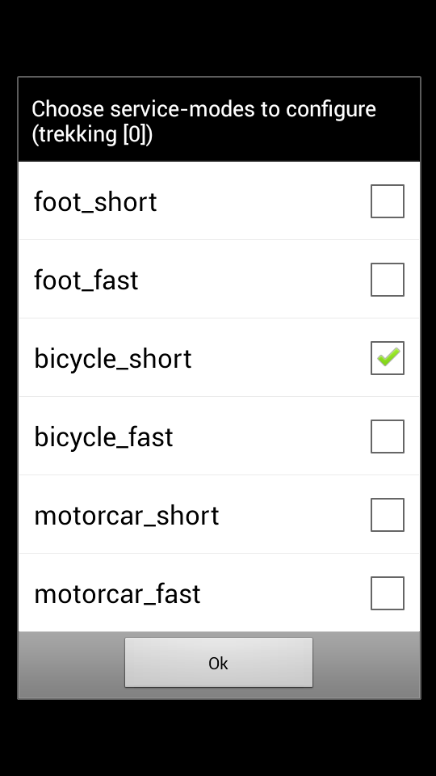
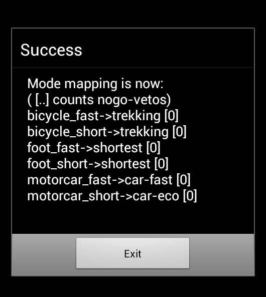

Using BRouter on Android with OSMAnd
====================================

BRouter integration in OSMAnd changed a lot during the summer of 2019. This
guide assumes you are using the BRouter Android app in version 1.5.0 or higher
as well as OSMAnd in version 3.4 or higher.

## Installing BRouter app on your Android device

First, install the BRouter app on your Android device from
[F-Droid](https://f-droid.org/packages/btools.routingapp) or [Google Play
Store](https://play.google.com/store/apps/details?id=btools.routingapp). You
can also build the BRouter Android app yourself.

## Downloading BRouter segments

Then, launch the BRouter app and choose "Download Manager". Zoom in and select
the areas you want to route in. Then click "Start Download" and BRouter will
start downloading the [segments](http://brouter.de/brouter/segments4/) files
for the selected areas.

Note that you will have to repeat this step periodically, whenever you want to have an
updated version of the OSM data used for the routing.

## Selecting profiles to use

Once this is done, start again the BRouter app and choose the "BRouter App"
entry on the main menu. Select the routing profile you want to use and click
"Server-Mode". Then, tick the boxes for the routing modes you want to use this
profile for. You can use two different profiles per transportation mode, which
will be mapped to the "shortest" and "fastest" presets (these are just
labelling) in OSMAnd.

## Configure OSMAnd to make use of BRouter offline navigation

You can now create an "Application profile" in OSMAnd which will be using
BRouter for offline routing. Go to Settings -> Application profiles -> Add and
create a new profile based on the base profile of your choice (cycling here,
for bicycle routing), with a custom name of your choice ("BRouter" on the
screenshot below) and making use of "BRouter (offline)" for navigation.

The BRouter app should be launched before OSMAnd for this specific entry to
appear in OSMAnd. Therefore, if you cannot find "BRouter (offline)" navigation
option, you should force quit OSMAnd and restart it.
